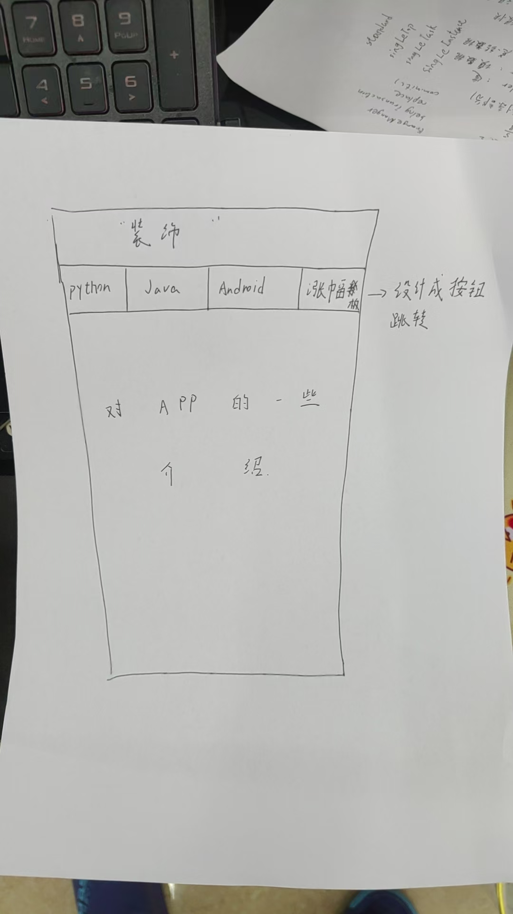
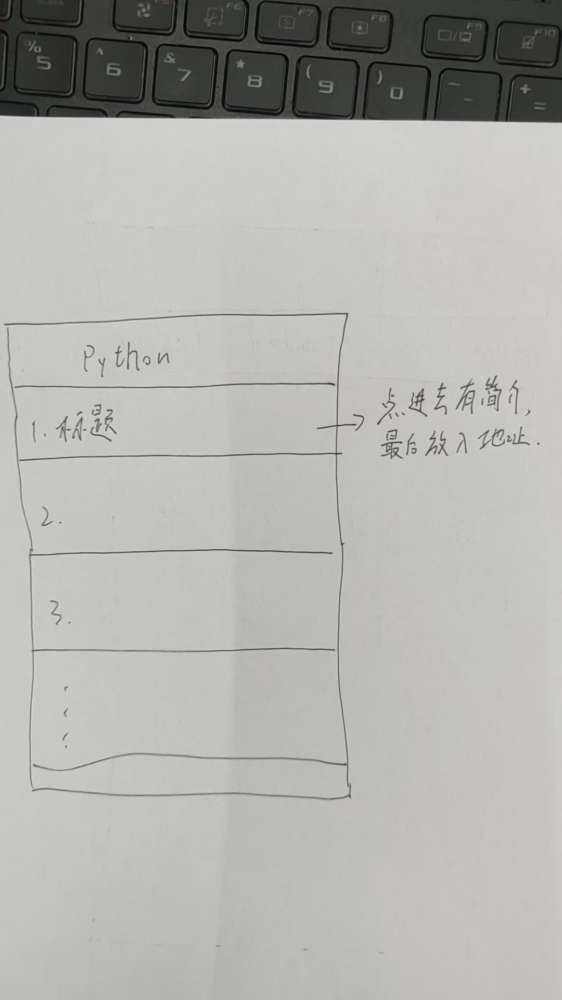

GitHub 排行榜 App

给中文用户看的 GitHub 项目排行榜。选语言看榜，点进去看中文简介和 README，没网也能看。

这是我在学 Android 的时候做的一个小项目。一开始是想做个新闻 App，做的过程中数据源换成了 GitHub 的排行榜接口，最后长成现在这样。代码里留了很多注释，是写给自己看的，所以看起来会比较啰嗦。

最初的想法

项目最开始是画在纸上的。当时想的是顶部几个分类按钮，下面一个列表：

后来每一行长什么样、点进去看什么，也画了：

现在做完了什么

- 首页。渐变背景加矢量插画，白天和夜晚两套配色，欢迎语会跟着时间变
- 榜单页。顶部一个下拉框切换 Android / Python / Java 三个榜，每行有排名，前三名是金银铜
- 详情面板。点列表里的卡片弹出来，居中、背景变暗。里面有中文简介、一张信息卡片、一个打开浏览器的按钮，还有渲染好的 README
- 中文简介。英文的简介会自动翻成中文，翻一次就存下来，同一条不会重复翻
- 离线可看。用了 Room 做缓存，打开时先显示缓存（秒出），再联网刷新。断网也能用
- README 渲染。用 Markwon 把 GitHub 的 README 渲染成带格式的文字
- 开机动画。用 Android 12 的 SplashScreen API，图标是纯 XML 画的矢量动画，一个图片素材都没用
- 配色。Material 3 的角色色，明暗主题它自己切

还没做的

- 科技新闻。想接一个 RSS 源，得先补一下 XML 解析
- 搜索。打算把榜单页那个下拉框改成能打字的，加载逻辑是现成的
- 我的收藏。加一张表，详情页加个星星按钮
- 涨星榜，也就是今天涨 star 最猛的。这个得每天存一次快照再相减。而且纯客户端做不出真正的“每日”，要靠服务端
- 卡片变面板的那个动画。试过 Material 的 Container Transform，没调通，先下线了

用的东西

UI 是 XML 布局加 Material 3，列表用 RecyclerView。
网络是 HttpURLConnection 加协程，数据库是 Room。
Markdown 渲染用 Markwon，启动画面用 androidx.core:core-splashscreen。
数据来自 GitHub 的搜索接口，翻译用的是 MyMemory 的免费接口。

几个撞出来才明白的事

一个是 ViewHolder 会复用。RecyclerView 只造够一屏用的 ViewHolder，滚出屏幕的会被回收，再装货给新出现的项用。所以 onBindViewHolder 里每一样属性都得设一遍。我一开始只给前三名设置排名数字的颜色，写成 if (position < 3)，结果十条数据的时候完全正常，因为差不多刚好一屏，没怎么复用。后来把每页条数改成三十，滚下去一看，第八名、第二十名的数字也变成金色了。车上还留着上一位乘客的颜色。

另一个是 HTTP 200 不等于成功。翻译接口出错的时候也返回 200，还把错误信息塞进了正常该放译文的地方。我的代码解析成功了，于是把错误信息当成译文存进了数据库。这个 bug 不报错也不崩溃，只是默默地往库里写脏数据。后来才明白，每个接口都有自己的成功标志，得读它自己的字段。

还有就是报错指向你没动过的东西时，别改它。有一次加了新页面之后 App 一点就崩，报错说 MaterialButton 的主题不对，可我根本没动过 MaterialButton。真正的原因是那个新页面漏了一行 installSplashScreen，整个页面卡在启动画面的主题里，Material 的控件全都找不到属性。反过来也一样，报错指向你动过的地方时，它常常在说该改成什么，要读全。

怎么跑

用 Android Studio 打开项目根目录就行，local.properties 它会自己生成。然后直接 Run。
需要 AGP 8.10.1、Kotlin 2.0.21、JDK 11 以上，设备或模拟器要 Android 8.0 以上。

几点说明

- 这是学习项目，不是产品。代码里注释比代码还多
- 数据来自 GitHub 公开接口，中文简介是 MyMemory 免费接口翻的，有配额限制，不适合商用
- 抓来的数据只用来学习
